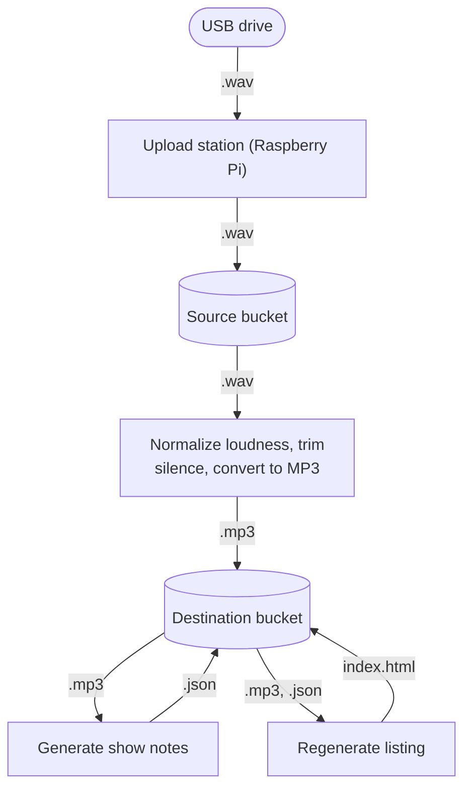

# The Station

Upload station for recordings from an audio console.

<!-- Add a photo here -->

## Compatibility

The Station currently matches file names formats for the following audio consoles:

- Behringer X32, Midas M32, Behringer Wing: `R_YYYYMMDD-HHMMSS.wav`
- Allen & Heath CQ: `AHCQ/USBREC/CQ-ST001.WAV`

## How it works



Every stage reads from a bucket and writes back to a bucket, so any stage can fail, be retried, or be swapped out without affecting the others.

1. **Upload station:** A service on the Raspberry Pi watches for USB drives and uploads any new recordings (matching the file-name formats above) to the source bucket.
2. **Normalize:** A Cloud Run service downloads the WAV, normalizes loudness, trims long silences, encodes to MP3, and writes the result to the destination bucket.
3. **Generate show notes:** Another Cloud Run step sends the MP3 to Gemini, which returns a suggested title, description, and start/end cut. The result is saved as a JSON sidecar next to the MP3.
4. **Regenerate listing:** Whenever a new MP3 or JSON appears, the listing page is rebuilt.

The destination bucket is served directly over HTTPS as static HTML, so the listing works without any application server.

## Deployment

The Station consists of two parts: the physical upload station and the cloud services that process the recordings.

### Cloud

The cloud services are deployed on Google Cloud Platform (GCP) using Terraform. Docker images are automatically built and pushed to Docker Hub when a new release is published.

First of all, you need to configure the variables in `terraform.tfvars` in your local clone of the repository. You can use the [terraform.tfvars.example](terraform.tfvars.example) file as a starting point.

1. Go to the [Google Cloud Console](https://console.cloud.google.com/).
2. Navigate to IAM & Admin > Service Accounts.
3. Create a new service account or select an existing one.
4. Assign the necessary roles
5. Generate a JSON key for the service account and download it to `cloud/service-account.json` in the repository (this file is git-ignored).

Before running Terraform, manually enable the Cloud Resource Manager API in Google Cloud.

### Raspberry Pi

#### Installing Raspberry Pi OS Lite

The Raspberry Pi should be running Raspberry Pi OS Lite. You can install it using the [Raspberry Pi Imager](https://www.raspberrypi.com/software/).

- When prompted to choose an OS, select "Raspberry Pi OS (other)" > "Raspberry Pi OS Lite (64-bit)" (or 32-bit if you're running an older Raspberry Pi model).
- In the Customization step, configure:
    - User: Set a username (e.g. `pi`) and password
    - Wi-Fi: Set the SSID and password for your network (if not using Ethernet)
    - Remote access: Enable SSH, and use public key authentication

The other steps can be left with their default/blank values.

#### Deploying the watcher

Before the first deploy, copy `raspberry_pi/ansible/vars.yml.example` to `raspberry_pi/ansible/vars.yml` and fill in your values. `vars.yml` is git-ignored.

Deploy the current working version of the watcher with Ansible:

```bash
cd raspberry_pi/ansible
ansible-playbook deploy.yml
```

The playbook detects the Pi's architecture, builds the binary with `cross` for the matching target (arm64 or armv7), and configures Raspberry Pi OS Lite.

## Development

### Previewing the audio file listing

To preview the audio file listing locally, you can use the following command:

```bash
cd cloud
uv run scripts/preview_template.py
```

### Infrastructure (Terraform)

```bash
cd cloud

# Initialize Terraform
terraform init

# Plan changes
terraform plan

# Apply infrastructure
terraform apply
```

## License

[GNU Affero General Public License v3.0](LICENSE)
